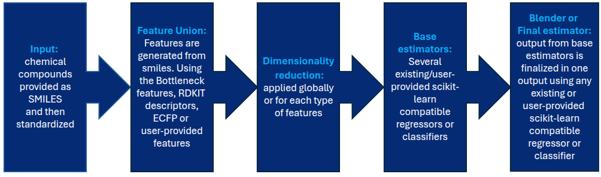
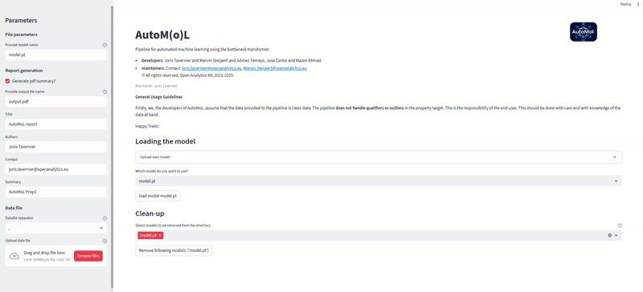
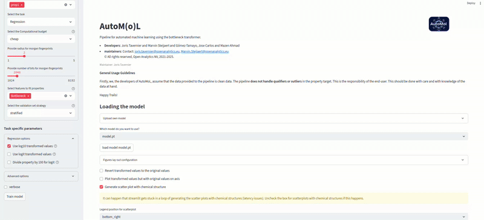
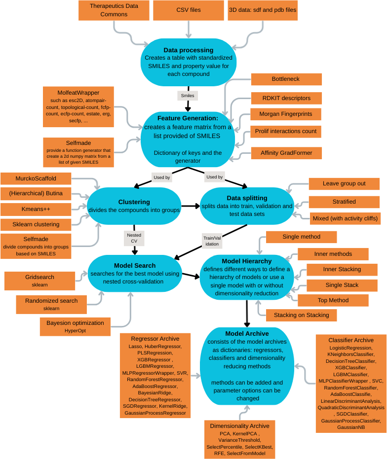
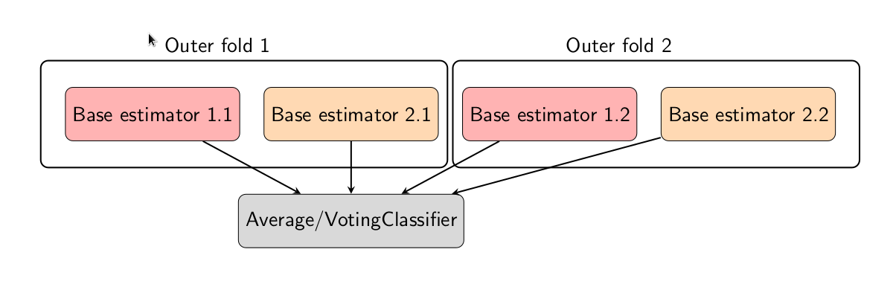
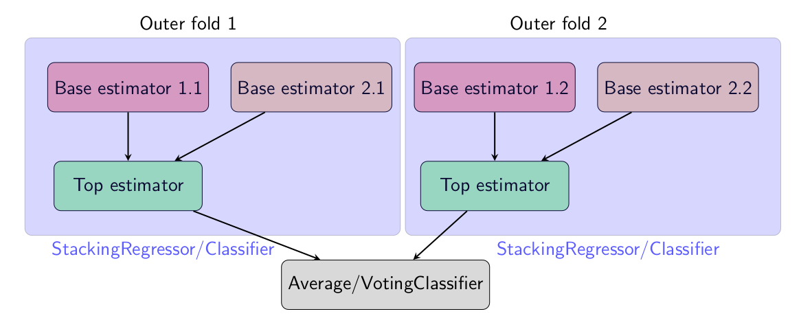
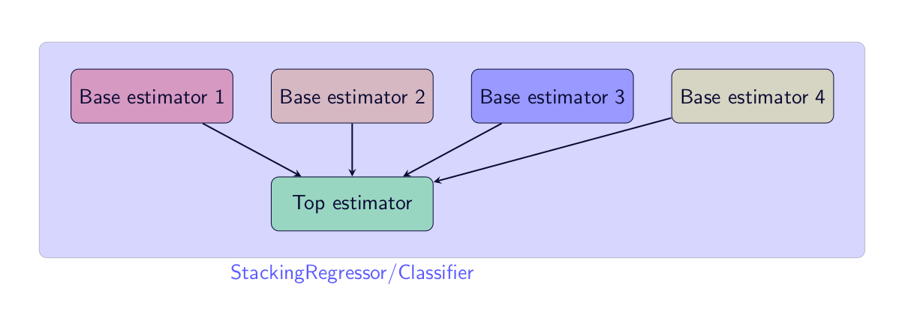
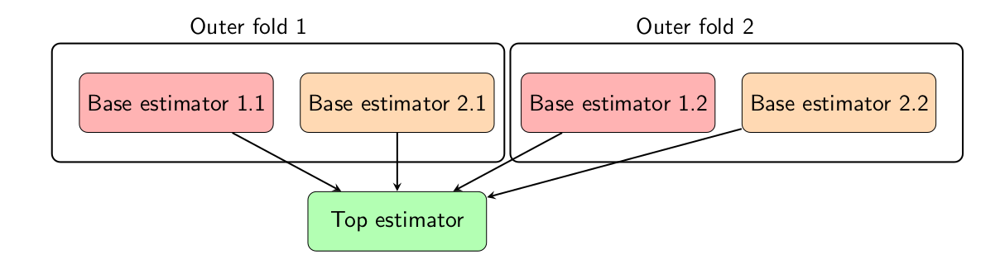

 

# AutoMol

[Installation](#install-package) • [Tutorials](#tutorials) • [Streamlit](#streamlit-app) • [Script](#python-script-with-yaml-file) • [Extending Automol](#adding-to-automol)• [Support](#contacts)

## Install AutoMol
Throughout the README, we assume that the terminal commands start from the root directory of the repository.
### Linux
For automated pdf generation wkhtmltopdf is used. On linux install with
```bash
sudo apt-get install wkhtmltopdf
```
We recommend using an uv environment for this package.We've included an install script for your convenience
```bash
chmod +x install_automol.sh
./install_automol.sh
```
otherwise you can install with
```
pip install uv
uv venv .venv --python 3.12
source .venv/bin/activate
uv pip install -r requirements.txt
uv pip install PyTDC
uv pip install rdkit==2024.3.5
uv run --with jupyter jupyter lab
```
or 
```bash
pip install uv
uv venv .venv --python 3.12
source .venv/bin/activate
uv pip install automol_resources/
uv pip install automol/
uv pip install molfeat
uv pip install streamlit
uv pip install PyTDC
uv pip install torch_geometric prolif lightning
uv pip install rdkit==2024.3.5
uv pip install jupyter jupyterlab
uv run --with jupyter jupyter lab
```

Additionally, you can use the provided docker image, still requires the installation of AutoMol. 

### Windows

There is an installation script for Windows, make sure to have python installed. Note that all tests and experiments were done in Linux.
```cmd
install_automol.bat
```

## AutoMol

AutoMol is the python package used by MolAgent to built generic models for early-stage drug discovery.

### Concept

The idea of the AutoMoL package is to enable Machine Learning for non-experts and their project specific properties. This was made possible by two core concepts: 1) use of highly-informative features and 2) the combination of multiple shallow learners. The overall concept is detailed in the Figure 1 below. The pipeline only requires SMILES as input and a provided property target. These SMILES are first standardized.  Next, features are generated using these standardized smiles. The generated features are optionally given to feature selection or dimensionality reduction methods before training several base estimators. The predictions of these base estimators are then provided as input to train a final estimator or blender. The predictions of this final estimator is the final output. The AutoMoL pipeline can be used for regression or classification tasks.



<sup> Figure 1. The concept of AutoMoL. Starting from the smiles, 
             features are generated and these features are used to
             train a combination of several shallow learners.</sup>
### Tutorials

Example Notebooks can be found in the folder Tutorials. In the tutorials we use data from [Therapeutic Data commons](https://tdcommons.ai/). A short summary for each notebook is given in the table below. 
| Notebook(s) | Summary |
| :-------------- | :---------------------------------------------------------- |
| [Classifier](Tutorials/Classifier.ipynb), [Regressor](Tutorials/Regressor.ipynb) and [RegressionClassifier](Tutorials/RegressionClassifier.ipynb)| The most basic notebooks for regression and classification. These notebooks include examples of target transformation, use of sample weights, 3 predefined computational load settings, data splitting, visualizations and pdf generation. |
| [Intermediate_Classifier](Tutorials/Intermediate_Classifier.ipynb), [Intermediate_Regressor](Tutorials/Intermediate_Regressor.ipynb) and [Intermediate_RegressorClassifier](Tutorials/Intermediate_RegressorClassifier.ipynb) | The intermediate notebooks for regression and classification. These notebooks include examples of functionality of the basic notebooks and adding feature generators, defining your own method hierarchy and dimensionality reduction.|
| [Expert_Classifier](Tutorials/Expert_Classifier.ipynb), [Expert_Regressor](Tutorials/Expert_Regressor.ipynb) and [Expert_RegressorClassifier](Tutorials/Expert_RegressorClassifier.ipynb) | The expert notebooks for regression and classification. These notebooks include examples of functionality of the intermediate notebooks and how to add your own regressor/classifier, define/set your own hyperparameters and define your own clustering algorithm.|
| [3DRegressor](Tutorials/3DRegressor.ipynb) | A notebook detailing the use of 3D feature generators such as prolif. |
| [RelativeRegressor](Tutorials/RelativeRegressor.ipynb) | A notebook detailing the use of relative ligand modelling. |
| [BlenderFeatures](Tutorials/BlenderFeatures.ipynb) |  A notebook detailing the use of feeding some features directly to the blender circumventing the base estimators.|
| [Clustering_visualization](Tutorials/Clustering_visualization.ipynb) | A notebook detailing visualizations of clustering results. In this notebook you can also check similarity between two data sets, for example train and test data. |
| [Data_cleaning](Tutorials/Data_cleaning.ipynb) | A notebook detailing limited data cleaning. |
| [Manipulating_models](Tutorials/Manipulating_models.ipynb)| A notebook detailing how to manipulate trained automol models, merging models or deleting trained targets.|
| [Molfeat_testing](Tutorials/Molfeat_testing.ipynb) | A notebook detailing the available featuregenerators from molfeat. |
| [MultiTarget_Classifier](Tutorials/MultiTarget_Classifier.ipynb) and [MultiTarget_Regressor](Tutorials/MultiTarget_Regressor.ipynb)| A notebook detailing how to train a model for multiple targets at once. Instead of separate hierarchies for each target. |
| [Plotly_pdf_generation](Tutorials/Plotly_pdf_generation.ipynb)| A notebook showing how to add your own plotly figure to the generated pdf. |

#### Tasks

We designed automol for three tasks: Classification, Regression and RegressionClassifier. This last term is defined for binary classification, where basicly model the classification problem as a regression problem with the target value being either 0 or 1. The output is then clipped to the interval [0,1] and used as the probability for the compound being classified as class 1.

#### 2D features

The 2D feature generation for chemical compounds is simply SMILES based. The default generators take as input a list of SMILES (strings) and return a data matrix containing the features. Automol has wrappers for the [molfeat](https://molfeat.datamol.io/) feature generators, as detailed in the Molfeat_testing [notebook](Tutorials/Molfeat_testing.ipynb).  

#### 3D features
The automol has some structure aware features, such as prolif, see the 3Dregressor notebook in the folder Tutorials for more information. You can use these in automol if you provide 3d information in the form of an sdf file and pdb files. Al the different pdbs should be placed in the same folder. This folder should be provided. The sdf file contains all the structures of the compounds. There should be a property pdb referencing the name of the pdb file to be used. Next to the pdb name, the code also requires a property with the target value of the compound. For example, after unzipping <i>Data/manuscript_data.zip</i>,  <i>Data/manuscript_data/ABL/selected_dockings.sdf</i> contains the ligands and the pdbs are located in <i>Data/manuscript_data/ABL/pdbs</i>. An example is given in this [notebook](Tutorials/3DRegressor.ipynb).

### Python script with yaml file

A python script that reads the options from a yaml file is provided in the folder script. 

```bash
source .venv/bin/activate
cd script/
uv run run_automol.py --yaml_file automl_reg.yaml
```

### Claude Code Skills

AutoMol includes two Claude Code skills for streamlined model training and prediction.

#### Starting Claude Code with the Plugin

```bash
claude --plugin-dir ./automol-tasks-manager/
```

#### Training Pipeline (`train-pipeline`)

Plan and execute a complete AutoMol training pipeline with automatic configuration:

```
> train a model on my_dataset.csv
```

The skill:
- Auto-detects SMILES columns, task type, and target properties
- Recommends features and computational load based on dataset characteristics
- Creates isolated run folders with full pipeline state
- Supports resuming interrupted training sessions

#### Prediction (`predict`)

Make predictions using trained models:

```
> predict on new_molecules.csv using the latest model
```

The skill auto-discovers models from the registry and handles both individual and merged model formats.

See [automol-tasks-manager/](automol-tasks-manager/) for skill documentation.

### Streamlit App
Streamlit app for regression and classification can be found in the folder streamlit_app. Upload your csv file and start modelling. Streamlit currently only supports bokeh version 2.4.3. From the repository directory run:
```bash
source .venv/bin/activate
uv pip install streamlit bokeh==2.4.3
cd streamlit_app/
uv run streamlit run automol_app.py
```
The following video shows the training steps: 

and this one the visualization in the streamlit app:  


### Adding to AutoMol
AutoMol allows users to add their own methods, feature generators and clustering algorithms. Figure 2 shows the AutoMol flow and several of its options. AutoMol is built upon [scikit-learn](https://scikit-learn.org/stable/). 


<sup> Figure 2. The flow of AutoMoL and most of its options.</sup>

#### Model Hierarchy
* **Single Method**: just one method. 
* **Inner Methods**: The base model outputs are simply averaged (regression) or provided to a voting classifier (classification). This is the simplest ensemble approach, where multiple models are trained independently, and their outputs are combined through simple aggregation. 



<sup> Figure 3: Example of the method configuration inner methods. Multiple instances of the same method can be found in each outer fold. </sup>

* **Inner Stacking**: This approach builds stacking models during the inner cross-validation loop and creates multiple stacking models, one for each outer fold, and combines their outputs. It provides robustness through diversity in both base models and meta-models. 



<sup> Figure 4: An example of the configuration Inner Stacking. Each outer fold is used to find the optimal stacking method for that fold. This results in multiple stacking methods.</sup>

* **Single Stack**: This approach builds a single stacking model directly optimized during the outer cross-validation. This configuration optimizes all components (base estimators and meta-model) simultaneously, finding the optimal combination for the specific task. 



<sup> Figure 5: An example of the hierarchy for the Single stacking configuration. There is only one instance for each method available as base estimator.</sup>

* **Top Method**: This procedure first finds the Base models and combines these with a single meta-model. In this configuration, base models are trained independently, and a single meta-model is fitted using their outputs. 



<sup> Figure 6: Example of the blender config, e.g. top method. The predictions of the base estimators are fed into the blender as input.</sup>


* **Top Stacking**: For this approach, the Base estimators are fitted during the inner cross-validation and then a stacking meta-model is fitted using these base estimators. This enhances the Top Method approach by using cross-validated outputs from base models to train the meta-model, reducing the risk of overfitting. 


<sup> Figure 7:  An example of the top stacking configuration. The base estimators and top estimator are place inside a Stacking method.</sup>


* **Stacking on Stacking**: The last approach is only available for classification and builds stacking models as base estimators within a stacking model. This creates a hierarchy of stacking models, allowing for complex relationships between different estimators. 

#### Adding an estimator
The model hierarchy of AutoMol uses method archives, in essence a dictionary with different methods and their parameter options ([src](automol/automol/stacking_methodarchive.py)) from [scikit-learn](https://scikit-learn.org/stable/).
```python
self.methods={
    'lasso':{f'{self.method_prefix}': [Lasso(tol=1e-2,max_iter=500)],
                f'{self.method_prefix}__alpha':loguniform(1e-5,1e2),
                f'{self.method_prefix}__random_state':random_state_list },
    'huber':{f'{self.method_prefix}': [HuberRegressor(tol=1e-2,max_iter=500)],
                f'{self.method_prefix}__alpha':loguniform(1e-5,1e2),
    ...
```

The archive provides functions to add new scikit-learn compatible estimators and change parameters through the function add_method and add_parameter. The following example is taken from the expert notebooks: [regression](Tutorials/Expert_Regressor.ipynb), [classification](Tutorials/Expert_Classifier.ipynb) and [regressionclassification](Tutorials/Expert_RegressorClassifier.ipynb). 

You can define your own estimator as we have done ([src](Tutorials/selfmade_sklearnregressor.py)). 

```python
from selfmade_sklearnregressor import MLPRegressorWrapper as myown_mlpregressor

#dictionary of parameter options of the regressor
mlp_param_dict={'hidden_layers':[1,2,3,4],
                'hidden_layers_size':[5,10,30,50],
                'learning_rate_init':[1e-4,1e-3,1e-2],
                'max_iter':[100,200,300]
                }
```
and add it to the method archive. 
```python
method_archive=RegressorArchive(method_prefix=prefixes['method_prefix'],distribution_defaults=distribution_defaults, ... )

#adjust parameters options of methods, add methods, etc ...
method_archive.add_param('rfr','n_estimators',[50,100,200,500])
method_archive.add_method('rfr',RandomForestRegressor(),{'n_estimators':[50,100,200,500]})

#adding random state list to the parameter options
mlp_param_dict['random_state']=random_state_list
#adding method to the archive
method_archive.add_method('my_mlp',myown_mlpregressor(),mlp_param_dict)
```

You can now use the new estimator in the model hierarchy using the key my_mlp as shown in section Choosing all methods and used features in the notebook [regression](Tutorials/Expert_Regressor.ipynb). 

#### Adding a Feature Generator
The AutoMol library uses the following interface for Feature generators ([src](automol/automol/feature_generators.py)). 
```python
class FeatureGenerator():
    def __init__(self):
        """
        Initialization of the base class
        """
        ## number of features
        self.nb_features=-1
        ## list of the names of the features
        self.names=[]
        ## the name of the generator
        self.generator_name=''
    
    def get_nb_features(self):
        """
        getter for the number of features.
        
        includes an assert that number of features is positive.
        
        Returns
            nb_features (int): number of features
        """
        assert self.nb_features>0, 'method not correctly created, negative number of features'
        return self.nb_features
    
    def check_consistency(self):
        """
        checks if the number of features is positive and the length of the feature names equal the number of features
        """
        assert len(self.names)==self.nb_features, 'Provided number of names is not equal to provided number of features'
        assert self.nb_features>0, 'negative number of features'
    
    def generate(self,smiles):
        """
        generate the feature matrix from a given list of smiles
        
        Args:
            smiles: list of smiles (list of strings)
        
        Returns:
            X: feature matrix as numpy array 
        """
        pass
    
    def generate_w_pairs(self,smiles,original_indices,new_indices):
        """
        generate the feature matrix from a given list of smiles
        
        Args:
            smiles: list of smiles (list of strings)
            original_indices: indices for pairs of ligands without reindexing after datasplitting
            new_indices: list indices for pairs of ligands with reindexing after datasplitting
        Returns:
            X: feature matrix as numpy array 
        """
        X=self.generate(smiles)
        X_p=np.zeros((len(new_indices),2*X.shape[1]))           
        for idx,(i,j) in enumerate(new_indices):
            X_p[idx,:]=np.hstack((X[i,:],X[j,:]))
        return X_p
    
    def get_names(self):
        """
        getter for the names of the features
        
        Returns:
            names (List[str]): list of names
        """
        return self.names
    
    def get_generator_name(self):
        """
        getter for the generator name
        
        Returns:
            generator_name (str): the name of the generator
        """
        return self.generator_name
```
Important is to set the attributes: 
```python
names
nb_features
```
and to implement the function:
```python
generate(self,smiles)
```
with smiles a list of smiles that returns a numpy 2d array with the features (rows= samples, columns=features). If you need to explicitly define pairwise feature generation, the generate_w_pairs function has to be implemented too. This can happen if there is preprocessed data that is accessed by its index before the data split. 

The following feature generator calls a hypothetical model that returns a dictionary of properties for the smiles ([example](Tutorials/selfmade_featuregenerator.py)).
```python
class DeployedModel(FeatureGenerator):
    def __init__(self,feature_properties=None,link="https://hypotheticallink.com/model/v/02/"):
        super(DeployedModel, self).__init__()
        self.link=link
        response = requests.post(self.link, 
                json={
                        'molecule': {'SMILES': ['Oc1ccc(cc1OC)C=O'], 'sdf': None}, 'user': 'autoML-user'
                    } 
            ) 
        out=response.json()
        if feature_properties is None:
            self.feature_properties=[key for key in out.keys() if key != '']
        else:
            for p in feature_properties:
                assert f'{p}'in out.keys(), f'Property {p} not in output provided model'
            self.feature_properties=feature_properties
        #self.nb_features and self.names Required for FeatureGenerator!
        self.nb_features=len(self.feature_properties)
        self.names=[f'DeployedModel_{p}' for p in self.feature_properties]
    
    def generate(self,smiles):
        self.check_consistency()
        #smiles per smiles (depends on the deployed model, do batching if possible!)
        response_dicts=[requests.post(self.link, 
                json={
                        'molecule': {'SMILES': smi, 'sdf': None}, 'user': 'autoML-user'
                    } 
            ).json() for smi in smiles]
        return np.stack([ np.stack([out[f'{p}'] for out in response_dicts],axis=0) for p in self.feature_properties], axis=-1)
```

This feature generator can be easily added to the workflow 
```python
from selfmade_featuregenerator import DeployedModel

try:
    feature_generators['model']=DeployedModel()
except:
    #hypothetical so it will fail
    print('modellink fails')
    
print('Available feature generator keys')
print(feature_generators.keys())
```
as detailed in section Self-Made feature generator of the expert notebooks: [regression](Tutorials/Expert_Regressor.ipynb), [classification](Tutorials/Expert_Classifier.ipynb) and [regressionclassification](Tutorials/Expert_RegressorClassifier.ipynb). 

The feature generators are SMILES based, this makes the the framework flexible but has its limitations. If you have a plain dataset of features, you still need to connect the index to the provided SMILES. This can be done by a dictionary connecting the SMILES to an index, but be aware of standardization of the SMILES and disable if required. 

#### Adding a Clustering Algorithm
The clustering algorithms within AutoMol inherit the following interface ([src](automol/automol/clustering.py)). 
```python
class ClusteringAlgorithm():
    def __init__(self):
        """!
        Initialization of the base class
        """
        ## groups (array)
        self._groups=[]
        self._sz=-1
        ## list of the names of the features
        self._generated_features={}

    
    def get_groups(self):
        """ Retrieve groups from algorithms

        Returns:
            groups (array): an array filled with cluster/group indices for each smiles

        """
        assert len(self._groups)>0, 'groups not initialised, call cluster'
        return self._groups
    
    def size(self):
        """ Retrieve groups from algorithms

        Returns:
            sz (int): size of the last given list of smiles

        """
        assert len(self._groups)==self.list_sz, 'The size of the given smiles is not equal the generated groups'
        return self._sz
    
    def get_generated_features(self):
        """ Retrieve generated features when assigning groups in algorithms
        
        example dictionary contains:
                example_dict={ key:{X:X, cid: generator_name }} with 
                key, the key from the feature_generator,
                 X,  the 2d numpy matrix and
                 generator_name, the name/version of the feature generator.

        Returns:
            generated_features (dict): return a dictionary with the keys and generated features of the clustering process.
        """
        return self._generated_features
    
    def cluster(self,smiles:List[str]):
        """generate the groups from a given list of smiles
        
        Args:
            smiles (list[str]): list of smiles (list of strings)
        
        Attributes:
            sz (int): length of smiles list
            groups (array): an array filled with cluster/group indices for the smiles list
        """
        pass
    
    def clear_generated_features(self):
        """clears the generated features
        
        Attributes:
            generated_features: set to empty
        """
        self._generated_features={}
```
In essence you only have to implement the init and cluster functionality. The cluster function takes as input a list/series of smiles and sets the 
attribute _groups. This is essential. The groups are the assigned cluster indices. 

The following example is available in AutoMol to use any sklearn clustering algorithm ([example](Tutorials/selfmade_clustering.py)). 
```python
class SklearnClusteringForSmiles(ClusteringAlgorithm):
    
    def __init__(self,*, feature_generators: dict= {},used_features:List[str]=None, random_state:int=42,sklearn_estimator=None):
        """initialisation of KmeansForSmiles with provided dictionary of feature generators and list of used features.
        
        If feature generation dictionary is not provided, default public generators are used
        
        If used features is not provided or provided features are not available in the generator dictionary,
                Bottleneck is used if present in generation dictionary,
                otherwise al generators in the dictionary are used. 
        
        Args:
            feature_generators(dict): dictionary containing different feature generators
            used_features(list[str]): list of keys indicating the used features
        """
        super(SklearnClusteringForSmiles, self).__init__()
        if not feature_generators or feature_generators is None:
            self._feature_generators= retrieve_default_offline_generators(model='ChEMBL', radius=2, nbits=2048)
        else:
            assert isinstance(feature_generators,dict), 'provided feature generators must be dictionary'
            self._feature_generators=feature_generators
            
        if used_features is None or len(used_features)<1:
            used_features=['Bottleneck']
        self._used_features=[]
        for feat in used_features:
            if feat in self._feature_generators:
                self._used_features.append(feat)

        self._random_state=random_state
        self._estimator=sklearn_estimator
            
    def cluster(self,smiles):
        """"generate the groups from a given list of smiles
        
        Args:
            smiles (list[str]): list of smiles (list of strings)
        
        Attributes:
            sz (int): length of smiles list
            groups (array): an array filled with cluster/group indices for the smiles list
            generated_features(dict): dictionary with all the generated feature matrices
        """
        
        smiles=self._check_input_smiles(smiles)
        self._groups=np.repeat(-1,len(smiles))
        
        X_list=[]
        for key in self._used_features:
            self._generated_features[key]= {'X': self._feature_generators[key].generate(smiles), 'cid': self._feature_generators[key].get_generator_name() }
            X_list.append(self._generated_features[key]['X'])
        X_train=np.concatenate( X_list, axis=-1)
        indices=np.array(list(range(len(smiles))))
        self._groups=np.repeat(-1,len(smiles))
        feature_na=np.array([ np.isnan(row).any() for j, row in enumerate(X_train)])
        
        groups=self._estimator.fit_predict(X_train[~feature_na])
        self._groups[~feature_na]=groups
```

This can then easily by integrated by using
```python
from selfmade_clustering import SklearnClusteringForSmiles as my_own_clustering #(also present in automol.clustering)

#https://scikit-learn.org/stable/modules/generated/sklearn.cluster.AgglomerativeClustering.html#sklearn.cluster.AgglomerativeClustering
from sklearn.cluster import AgglomerativeClustering
sklearn_clustering=AgglomerativeClustering(n_clusters=30)

#create your clustering method 
clustering_algo=my_own_clustering(feature_generators =f eature_generators, used_features=['Bottleneck'], random_state=42, sklearn_estimator = sklearn_clustering)
```

This algorithm can then easily be used when clustering for the cross-validation or data splitting as shown in the section Clustering the data for nested cross-validation and Splitting the data in Training and Validation sets of the expert notebooks: [regression](Tutorials/Expert_Regressor.ipynb), [classification](Tutorials/Expert_Classifier.ipynb) and [regressionclassification](Tutorials/Expert_RegressorClassifier.ipynb).


### Unittest

To execute unittests run the following command from the root directory of the repository:
```bash
source .venv/bin/activate
cd automol/automol/
uv run -m unittest discover -cf
```

This does create model files in the execution directory to test saving and reloading models!

## Contacts

* **Authors**: Joris Tavernier, Marvin Steijaert
* **Contact**: joris.tavernier@openanalytics.eu, Marvin.Steijaert@openanalytics.eu


